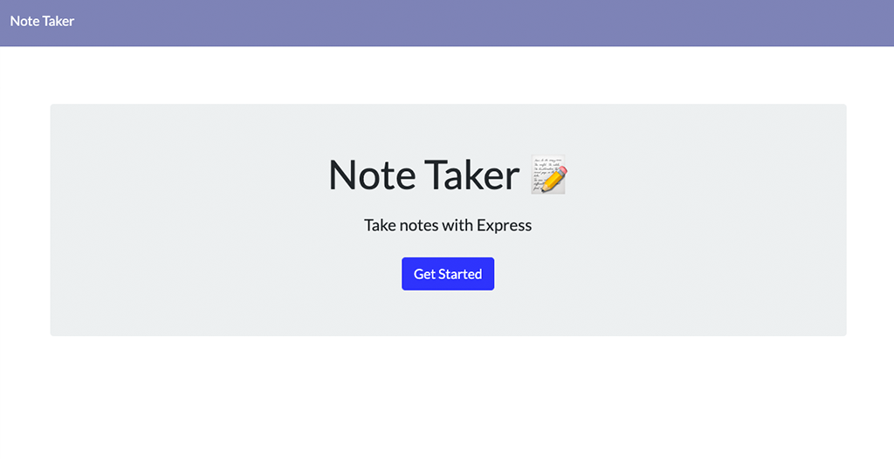

<h1 align="center">Quick Project Notes 🚀 </h1>

 
## Description
This is a website application on express that helps a user keep track of their notes. It's just a different way.

## Table of Contents
- [Description](#description)
- [Installation](#installation)
- [Usage](#usage)
- [License](#license)
- [Contributing](#contributing)
- [Tests](#tests)
- [Questions](#questions)
## Installation
Run the app by going to https://immense-headland-56639.herokuapp.com/
## Usage
This is for students and profesionals to stay organized.
## License

 
This application is covered by the MIT license. 
## Contributing
Xander Rapstine, John McCambridge, and Kat Contreras.
## Tests
Not right now.
## Questions
Send me an email to kat.contreras@gmail.com with your questions.  
 
:octocat: Find me on GitHub: [katcontrerasdev](https://github.com/katcontrerasdev) 
 
Email me with any questions: kat.contreras@gmail.com  
